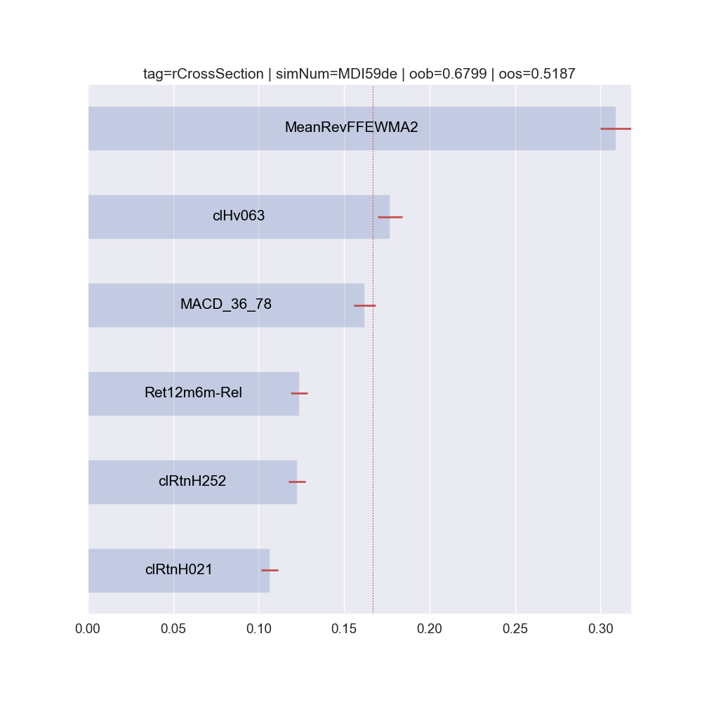
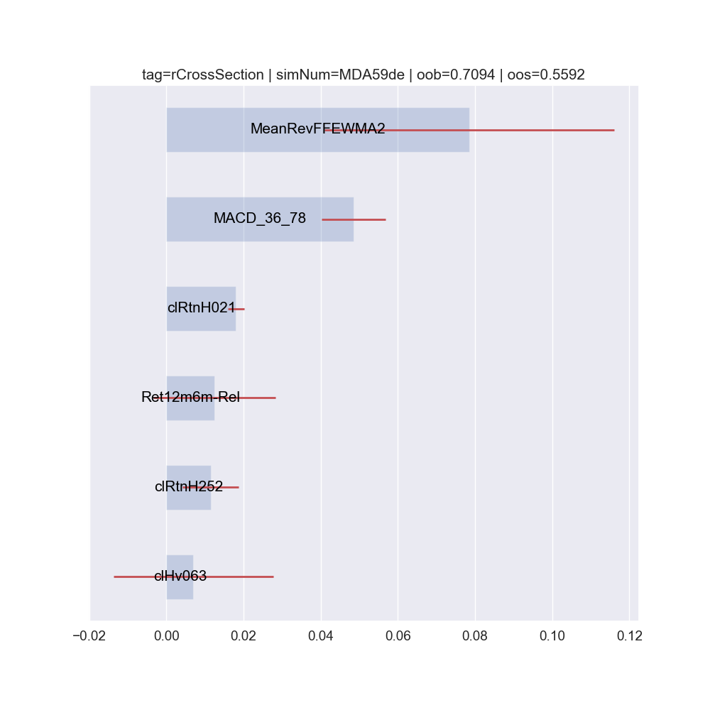
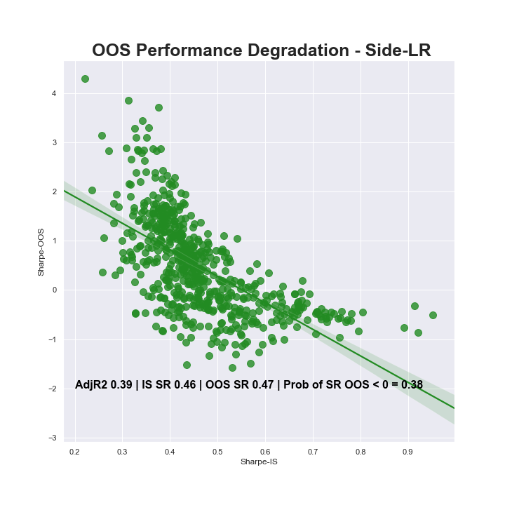
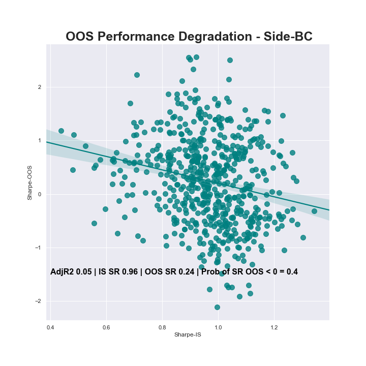

# TSRV
Time Series Analysis on Relative Value ETFs

In this Package we are using datascience / ML models to forecast relative returns for sector ETF's.

In particular we focus on Sector ETF performance relative to SPY (the broad market)

We have two notebooks and a folder structure to hold all our EDA, model testing/validation, & back test results:

	- EDA_s0 holds our introductory scatter plots, shows how we compute all features*
		- We show cointegration using ADF on relative returns
		- Plot our features for visual confirmation/priming of modeling relationship
		- Show how correlation can be used to split our ETF's into seperate datasets

	- ModelFit_s2 holds our modeling process from start to finish
		- This includes Random Forest/Logistic Regression Models
		- Demo of using feature importance for financial markets research * 
		- Combinatorial Backtesting Method 
		- Walk Forward Backtesting Method

Sample Plots from our Analysis:

Mean Decrease in Importance (final iteration):

Mean Accuracy improvement over noised feature (MDA): 

ROC for test set starting in 2017-06-30 - 8/2019:

IS Sharpe vs Out of Sample Sharpes for 3M time periods combinatorially trained, purged & measured using model predictions and test returns

Walk Forward Tabular Results:

We used 10 bp or 1/10th of a percent for transaction costs

Walk forward Stats |
--- |
Ann-Return | 10.090
Ann-Vol | 8.000
Sharpe | 1.261
Ann-Alpha-Bench | -0.540
Ann-Alpha-Eq |	2.720
TE-Bench | 8.807
TE-EQwtd | 3.682
IR-SPY | -0.061
IR-EQ |	0.739
TestYears |	4.670
TCost |	10.000

* We used the ta package heavily for creation of technical features: 
	[TA](https://github.com/bukosabino/ta)
* We use Methods in our feature construction & modeling from Marcos Lopez de Prado Advances in Financial Machine Learning (2018)
